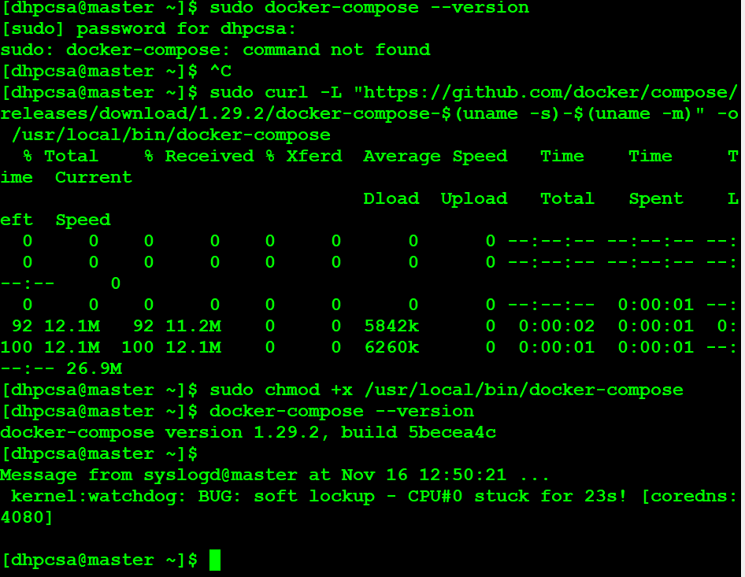
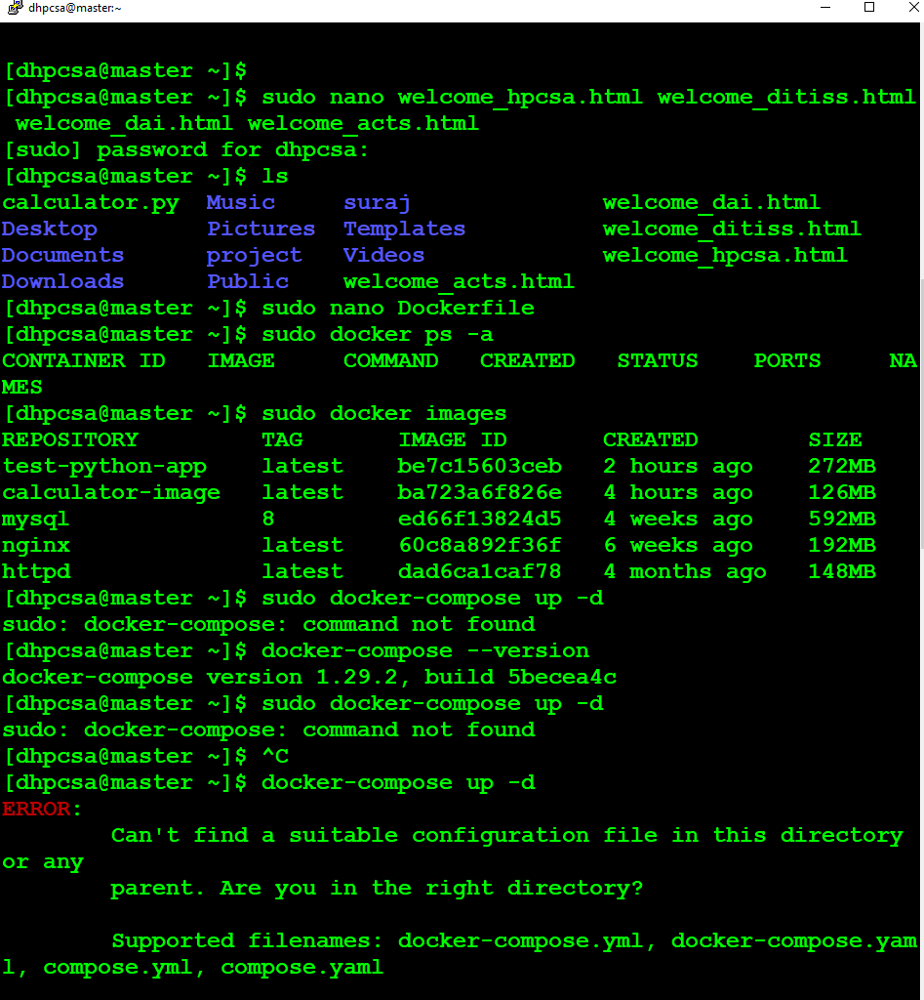
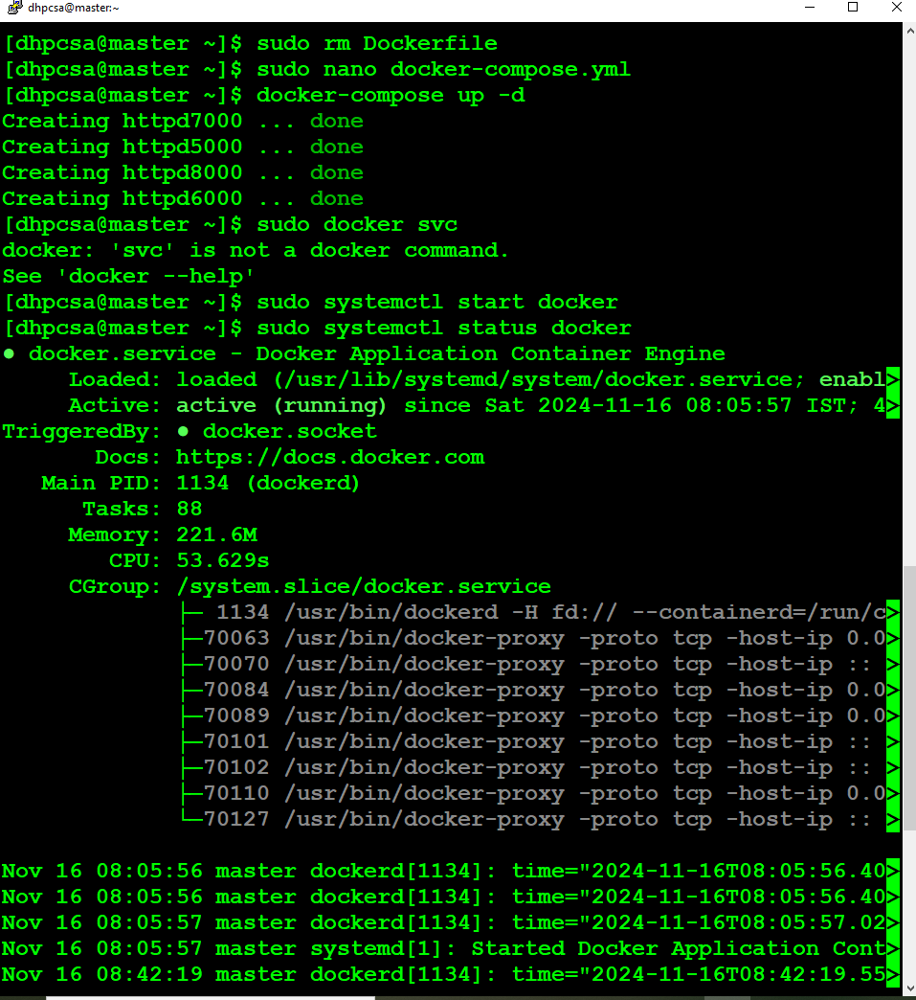
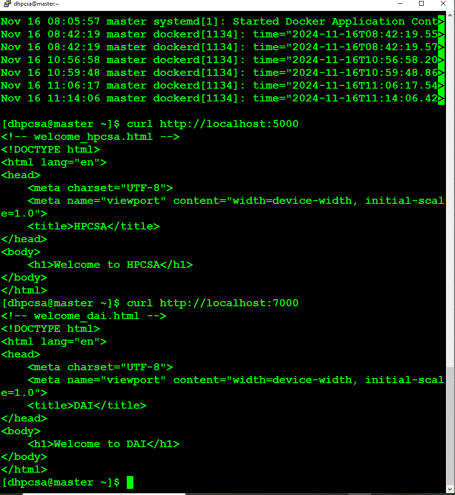
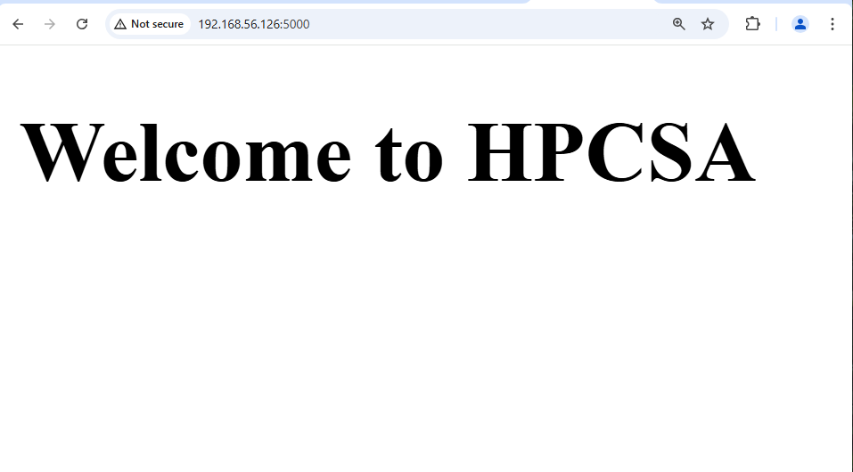
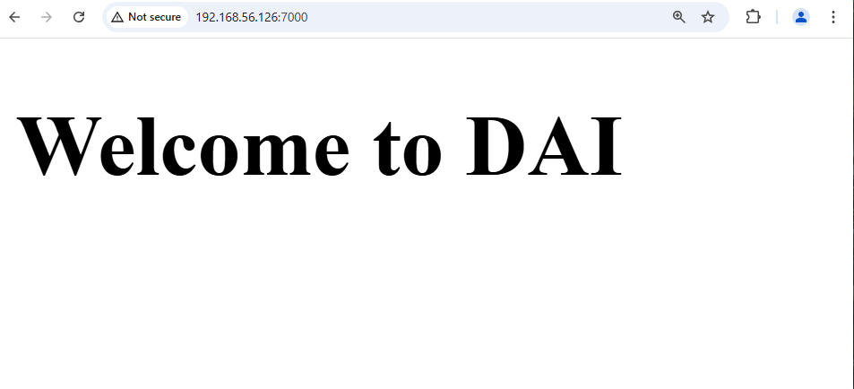
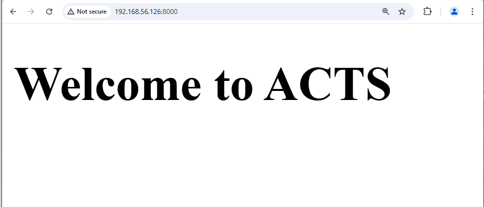

## Overview: What Are We Doing?


1. Install Docker Compose on Linux.
2. Create a docker-compose.yml file to:
   - Spin up 4 Apache HTTPD containers.
   - Map ports 5000, 6000, 7000, and 8000.
   - Serve unique welcome messages on each port using custom HTML files.
3. Launch and verify the containers using Docker Compose.
4. Understand how to manage the containers effectively.

## Follow the steps to Implement.

### Step 1. Install Docker Compose
  - Download Docker Compose:

```yml

sudo curl -L "https://github.com/docker/compose/releases/download/1.29.2/docker-compose-$(uname -s)-$(uname -m)" -o /usr/local/bin/docker-compose

```

  - Make it executable:

```yml
sudo chmod +x /usr/local/bin/docker-compose
```

  - Verify the installation:

```yml
docker-compose --version
```
  *If installed correctly, it will display the version.*

### Step 2. Directory Setup
  - Create a project directory and navigate into it:

```yml
mkdir my-docker-compose
cd my-docker-compose
```

  - Create custom HTML files:
*Each container will serve a unique welcome message.*

#### File 1: welcome_hpcsa.html (for port 5000):

```yml
<!DOCTYPE html>
<html>
<head><title>HPCSA</title></head>
<body><h1>Welcome to HPCSA</h1></body>
</html>
```
#### File 2: welcome_ditiss.html (for port 6000):

```yml
<!DOCTYPE html>
<html>
<head><title>DITISS</title></head>
<body><h1>Welcome to DITISS</h1></body>
</html>
```
#### File 3: welcome_dai.html (for port 7000):

```yml
<!DOCTYPE html>
<html>
<head><title>DAI</title></head>
<body><h1>Welcome to DAI</h1></body>
</html>
```
#### File 4: welcome_acts.html (for port 8000):

```yml
<!DOCTYPE html>
<html>
<head><title>ACTS</title></head>
<body><h1>Welcome to ACTS</h1></body>
</html>
```

### Step 3. Create docker-compose.yml
 *In the same directory, create docker-compose.yml with the following content:*

 ```yml

version: '3'
services:
  httpd5000:
    image: httpd:latest
    container_name: httpd5000
    ports:
      - "5000:80"
    volumes:
      - ./welcome_hpcsa.html:/usr/local/apache2/htdocs/index.html
    networks:
      - webnet

  httpd6000:
    image: httpd:latest
    container_name: httpd6000
    ports:
      - "6000:80"
    volumes:
      - ./welcome_ditiss.html:/usr/local/apache2/htdocs/index.html
    networks:
      - webnet

  httpd7000:
    image: httpd:latest
    container_name: httpd7000
    ports:
      - "7000:80"
    volumes:
      - ./welcome_dai.html:/usr/local/apache2/htdocs/index.html
    networks:
      - webnet

  httpd8000:
    image: httpd:latest
    container_name: httpd8000
    ports:
      - "8000:80"
    volumes:
      - ./welcome_acts.html:/usr/local/apache2/htdocs/index.html
    networks:
      - webnet

networks:
  webnet:
    driver: bridge


```


<br>


 - Service Definition:
       *The file defines four distinct services using the Apache HTTP server (httpd), each configured to serve different HTML content on specific ports. These services (httpd5000, httpd6000, httpd7000, and 
        httpd8000) are isolated containers running the same base image (httpd:latest), but each one serves a unique HTML page.*

 - Image and Container Naming:
   *Each service uses the same httpd image, ensuring consistency in the environment setup. The container name for each service is explicitly defined (httpd5000, httpd6000, etc.), which helps 
    with identification and management, especially when you are working with multiple containers*

  - Port Mapping:
     *The ports section maps the host machine’s ports to the container’s default Apache port (80). For instance, port 5000 on the host maps to port 80 inside the httpd5000 container. This 
      exposes different web applications running in separate containers, each bound to a unique port for access.*

  - Volume Mapping:
      *The volumes section ensures that specific HTML files on the host system (e.g., ./welcome_hpcsa.html) are mounted into the container’s file system. The mapping directs these files to 
      Apache’s default directory for serving HTML content (/usr/local/apache2/htdocs/index.html). This enables the serving of custom content without modifying the container's internal setup.*

   - Networking Configuration:
       *The containers are all connected to the same bridge network (webnet), allowing them to communicate with each other if needed. The use of a custom network provides network isolation 
        from other containers or external systems, enhancing security and organization in a multi-container setup.*

   - Network Driver:
      *The bridge network driver is used, which is Docker's default for containers running in isolation. This creates a virtual private network for the containers, ensuring that they can 
       communicate internally, but remain isolated from the external environment unless explicitly exposed through ports.*

   - Scalability and Extensibility:
       *This configuration is easy to scale. You could add more httpd services, adjust the volumes for different HTML content, or modify the ports to expand the deployment. This flexibility 
       makes Docker Compose a powerful tool for managing containerized applications.*

   - Separation of Concerns:
       *By using separate containers for different services, the setup maintains logical isolation of the applications, which is crucial for troubleshooting, scalability, and maintaining 
        clean separation between services, even if they are based on the same underlying technology (Apache HTTP server in this case).*

*In summary, this file outlines an advanced configuration for serving multiple web applications in an isolated, containerized environment. It leverages Docker's powerful networking and volume management features to ensure efficiency and flexibility in how web applications are served, all while maintaining simplicity and scalability.*


<br>

### Step 4. Start the Containers
 *Run the following command in the directory containing docker-compose.yml:*

```yml
docker-compose up -d
```
What happens when we do this ?
  - Docker Compose will pull the httpd image (if not already available).
  - Create and start 4 containers, each mapped to ports 5000, 6000, 7000, and 8000.

### Step 5. Verify the Setup
 1. Open the following URLs in your browser to test:

  - http://localhost:5000 → Displays "Welcome to HPCSA".
  - http://localhost:6000 → Displays "Welcome to DITISS".
  - http://localhost:7000 → Displays "Welcome to DAI".
  - http://localhost:8000 → Displays "Welcome to ACTS".
    
*If you're using a remote server, replace localhost with the server's IP address.*

### Step 6. Stop the Containers
 *To stop and remove the containers, use:*

```yml
docker-compose down
```

<br>
<br>

### What Did We Learn By Implementing this?

1. Docker Compose Basics:

  - How to define multiple services in a single YAML file.

2. Port Mapping and Volume Binding:

  - Map host ports to container ports and bind custom HTML files to serve specific   
     content.

3. Efficient Container Management:

  - Manage multiple containers simultaneously using docker-compose up and docker-   
    compose down.


<br>
<br>

*You now know how to create and manage multiple containers with Docker Compose effectively. 🚀*


<br>
<br>
<br>


## ------------------Screnshots--------------------
1.
<br>
<br>




2.
<br>
<br>





3.
<br>
<br>




<br>
<br>


4.
<br>
<br>




<br>
<br>

5.
<br>
<br>




<br>
<br>


6.
<br>
<br>




<br>
<br>


7.
<br>
<br>




<br>
<br>


